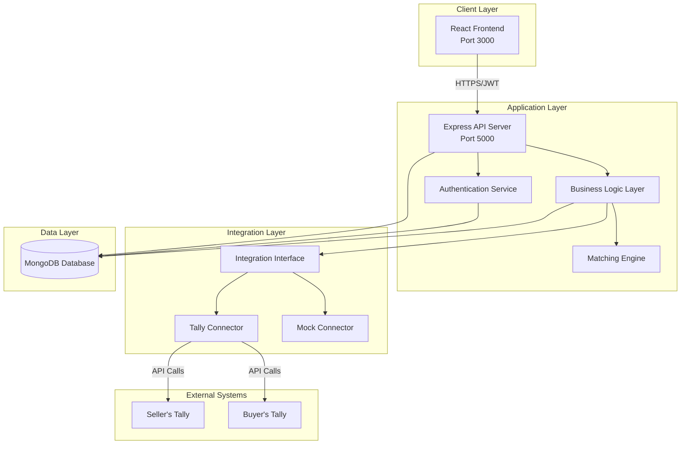
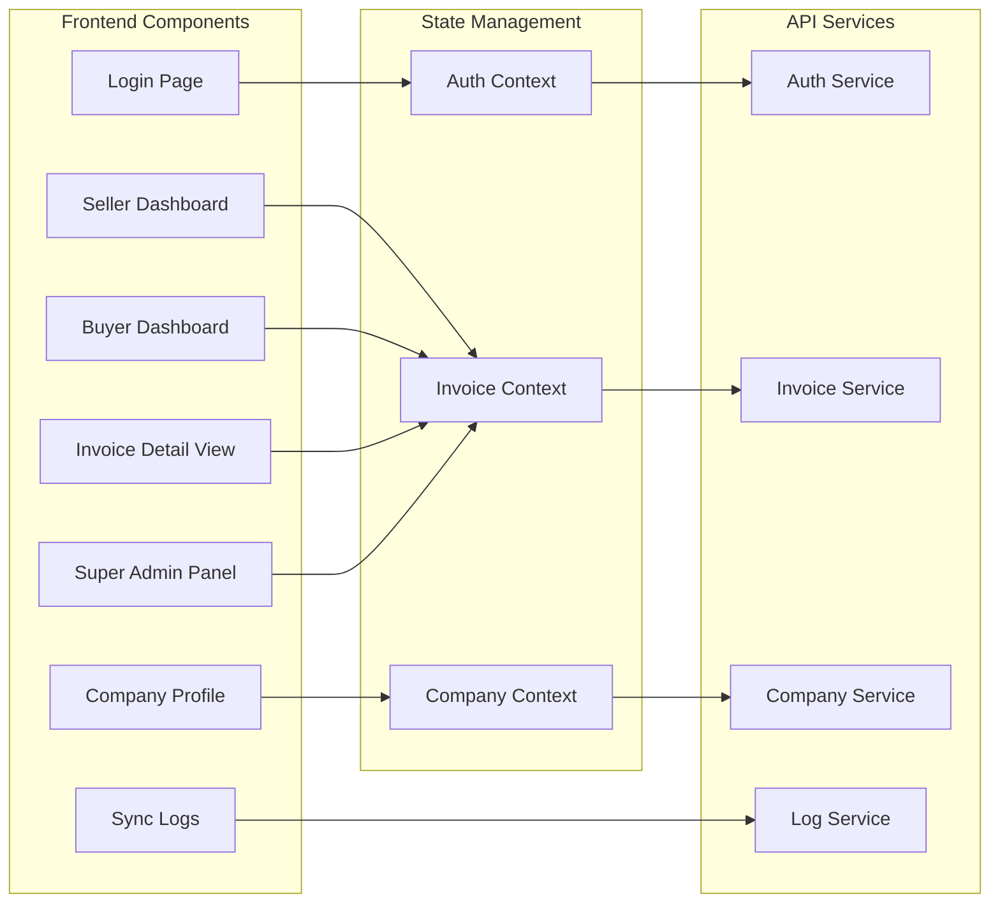
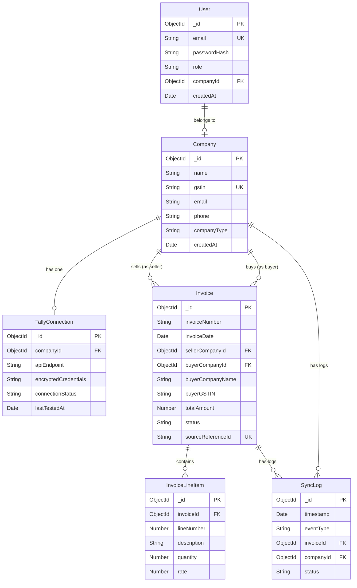
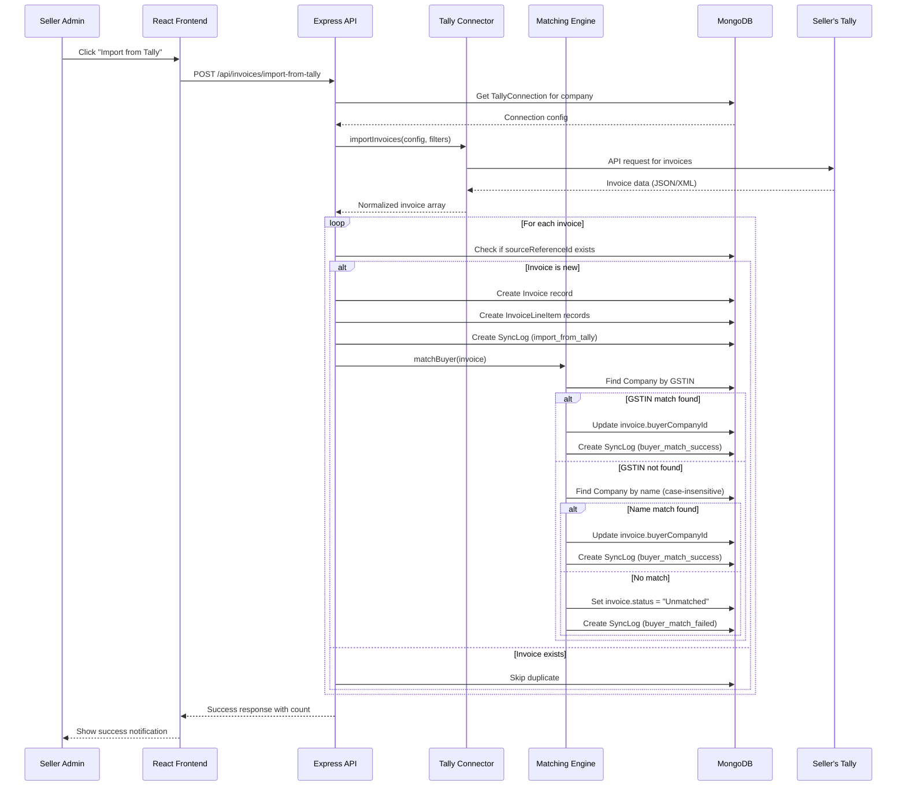
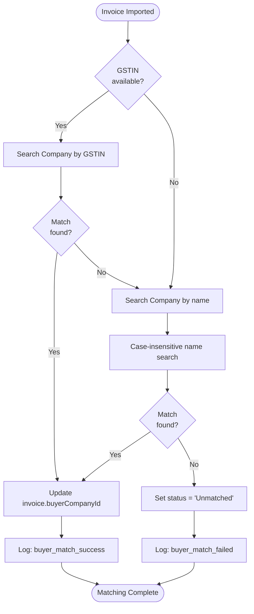
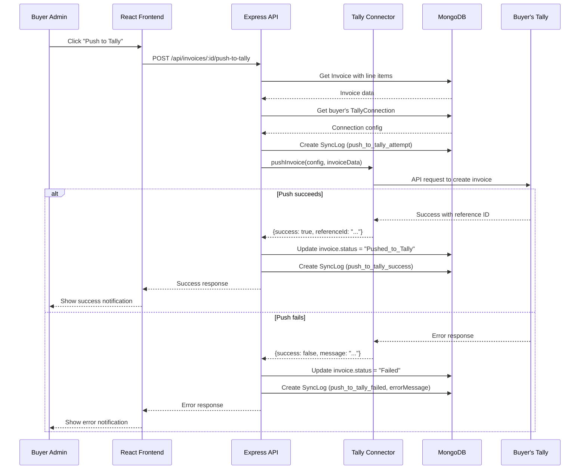
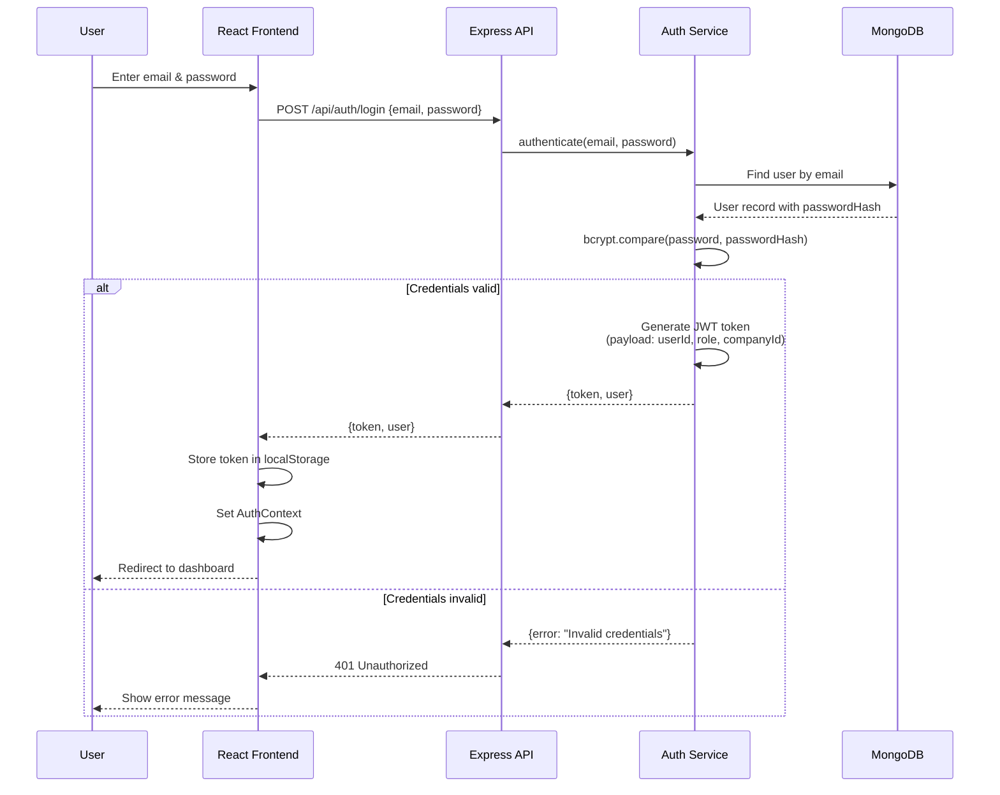

# Design Document: B2B Invoice Sync Platform MVP

## Overview

The B2B Invoice Sync Platform is a MERN stack (MongoDB, Express.js, React, Node.js) web application that serves as a middleware layer between Tally accounting systems. It enables seller companies to import invoices from their Tally instance, automatically matches these invoices with buyer companies, and allows buyers to push matched invoices into their own Tally system with one click.

### Key Design Goals

1. **Modularity**: Clean separation between UI, business logic, and integration layers
2. **Extensibility**: Architecture supports adding new accounting software connectors beyond Tally
3. **Security**: Encrypted credential storage, JWT-based authentication, input validation
4. **Testability**: Mock connector support for development and testing
5. **Maintainability**: Clear interfaces and separation of concerns

### Technology Stack

- **Frontend**: React 18+ with React Router, Context API for state management
- **Backend**: Node.js 18+ with Express.js 4.x
- **Database**: MongoDB 6.x with Mongoose ODM
- **Authentication**: JWT (jsonwebtoken library)
- **Encryption**: crypto-js for credential encryption
- **HTTP Client**: axios for Tally API communication

## Architecture

### High-Level System Architecture



### Component Architecture



## Components and Interfaces

### Backend Component Structure

```
backend/
├── server.js                 # Express app initialization
├── config/
│   ├── database.js          # MongoDB connection
│   ├── jwt.js               # JWT configuration
│   └── encryption.js        # Encryption utilities
├── models/
│   ├── User.js              # User schema
│   ├── Company.js           # Company schema
│   ├── Invoice.js           # Invoice schema
│   ├── InvoiceLineItem.js   # Line item schema
│   ├── SyncLog.js           # Sync log schema
│   └── TallyConnection.js   # Tally connection schema
├── routes/
│   ├── auth.routes.js       # Authentication endpoints
│   ├── invoice.routes.js    # Invoice endpoints
│   ├── company.routes.js    # Company endpoints
│   └── log.routes.js        # Log endpoints
├── controllers/
│   ├── auth.controller.js   # Auth business logic
│   ├── invoice.controller.js # Invoice business logic
│   ├── company.controller.js # Company business logic
│   └── log.controller.js    # Log business logic
├── services/
│   ├── matching.service.js  # Buyer matching logic
│   └── syncLog.service.js   # Sync logging service
├── integrations/
│   ├── IIntegrationConnector.js  # Interface definition
│   ├── TallyConnector.js         # Tally implementation
│   └── MockConnector.js          # Mock for testing
└── middleware/
    ├── auth.middleware.js    # JWT validation
    ├── validation.middleware.js # Input validation
    └── error.middleware.js   # Error handling
```

### Frontend Component Structure

```
frontend/
├── src/
│   ├── App.js
│   ├── index.js
│   ├── contexts/
│   │   ├── AuthContext.js     # Auth state management
│   │   ├── InvoiceContext.js  # Invoice state management
│   │   └── CompanyContext.js  # Company state management
│   ├── components/
│   │   ├── common/
│   │   │   ├── Navbar.js
│   │   │   ├── LoadingSpinner.js
│   │   │   ├── Notification.js
│   │   │   └── StatusBadge.js
│   │   ├── auth/
│   │   │   ├── LoginForm.js
│   │   │   └── RegisterForm.js
│   │   ├── invoice/
│   │   │   ├── InvoiceTable.js
│   │   │   ├── InvoiceDetailModal.js
│   │   │   └── LineItemTable.js
│   │   ├── company/
│   │   │   ├── CompanyProfile.js
│   │   │   └── TallyConnectionForm.js
│   │   └── logs/
│   │       ├── SyncLogTable.js
│   │       └── LogFilter.js
│   ├── pages/
│   │   ├── LoginPage.js
│   │   ├── SellerDashboard.js
│   │   ├── BuyerDashboard.js
│   │   ├── CompanyProfilePage.js
│   │   ├── SyncLogsPage.js
│   │   └── SuperAdminPanel.js
│   └── services/
│       ├── api.js             # Axios instance with JWT
│       ├── authService.js     # Auth API calls
│       ├── invoiceService.js  # Invoice API calls
│       ├── companyService.js  # Company API calls
│       └── logService.js      # Log API calls
```

### Integration Interface Definition

All accounting software connectors must implement the `IIntegrationConnector` interface:

```javascript
// IIntegrationConnector.js
class IIntegrationConnector {
  /**
   * Test connectivity to accounting software
   * @param {Object} connectionConfig - Connection configuration
   * @returns {Promise<{success: boolean, message: string}>}
   */
  async testConnection(connectionConfig) {
    throw new Error('Method not implemented');
  }

  /**
   * Import invoices from accounting software
   * @param {Object} connectionConfig - Connection configuration
   * @param {Object} filters - Date range and other filters
   * @returns {Promise<Array>} Array of invoice objects
   */
  async importInvoices(connectionConfig, filters) {
    throw new Error('Method not implemented');
  }

  /**
   * Push invoice to accounting software
   * @param {Object} connectionConfig - Connection configuration
   * @param {Object} invoiceData - Invoice data to push
   * @returns {Promise<{success: boolean, referenceId: string, message: string}>}
   */
  async pushInvoice(connectionConfig, invoiceData) {
    throw new Error('Method not implemented');
  }
}
```

## Data Models

### MongoDB Schema Definitions

#### User Schema

```javascript
{
  _id: ObjectId,
  email: { type: String, required: true, unique: true, lowercase: true },
  passwordHash: { type: String, required: true },
  role: { type: String, enum: ['seller_admin', 'buyer_admin', 'super_admin'], required: true },
  companyId: { type: ObjectId, ref: 'Company', required: function() { return this.role !== 'super_admin'; } },
  createdAt: { type: Date, default: Date.now },
  updatedAt: { type: Date, default: Date.now }
}
```

**Indexes:**
- `email` (unique)
- `companyId`

#### Company Schema

```javascript
{
  _id: ObjectId,
  name: { type: String, required: true },
  gstin: { type: String, required: true, unique: true, uppercase: true, length: 15 },
  email: { type: String, required: true },
  phone: { type: String },
  companyType: { type: String, enum: ['seller', 'buyer', 'both'], required: true },
  createdAt: { type: Date, default: Date.now },
  updatedAt: { type: Date, default: Date.now }
}
```

**Indexes:**
- `gstin` (unique)
- `name` (text index for searching)

#### TallyConnection Schema

```javascript
{
  _id: ObjectId,
  companyId: { type: ObjectId, ref: 'Company', required: true, unique: true },
  apiEndpoint: { type: String, required: true },
  encryptedCredentials: { type: String, required: true }, // AES encrypted JSON string
  connectionStatus: { type: String, enum: ['connected', 'disconnected', 'error'], default: 'disconnected' },
  lastTestedAt: { type: Date },
  lastError: { type: String },
  createdAt: { type: Date, default: Date.now },
  updatedAt: { type: Date, default: Date.now }
}
```

**Indexes:**
- `companyId` (unique)

#### Invoice Schema

```javascript
{
  _id: ObjectId,
  invoiceNumber: { type: String, required: true },
  invoiceDate: { type: Date, required: true },
  sellerCompanyId: { type: ObjectId, ref: 'Company', required: true },
  buyerCompanyId: { type: ObjectId, ref: 'Company' }, // null if unmatched
  buyerCompanyName: { type: String, required: true },
  buyerGSTIN: { type: String },
  taxableAmount: { type: Number, required: true },
  taxAmount: { type: Number, required: true },
  totalAmount: { type: Number, required: true },
  status: { 
    type: String, 
    enum: ['New', 'Accepted', 'Rejected', 'Pushed_to_Tally', 'Failed', 'Unmatched'], 
    default: 'New' 
  },
  sourceReferenceId: { type: String, required: true, unique: true }, // Prevents duplicate imports
  rawPayload: { type: Object }, // Original Tally response for debugging
  createdAt: { type: Date, default: Date.now },
  updatedAt: { type: Date, default: Date.now },
  statusChangedAt: { type: Date, default: Date.now }
}
```

**Indexes:**
- `sellerCompanyId` + `invoiceDate` (compound, for seller dashboard queries)
- `buyerCompanyId` + `invoiceDate` (compound, for buyer dashboard queries)
- `sourceReferenceId` (unique, for duplicate prevention)
- `status`

#### InvoiceLineItem Schema

```javascript
{
  _id: ObjectId,
  invoiceId: { type: ObjectId, ref: 'Invoice', required: true },
  lineNumber: { type: Number, required: true },
  description: { type: String, required: true },
  quantity: { type: Number, required: true },
  rate: { type: Number, required: true },
  taxableAmount: { type: Number, required: true },
  taxAmount: { type: Number, required: true },
  createdAt: { type: Date, default: Date.now }
}
```

**Indexes:**
- `invoiceId`

#### SyncLog Schema

```javascript
{
  _id: ObjectId,
  timestamp: { type: Date, default: Date.now, required: true },
  eventType: { 
    type: String, 
    enum: [
      'import_from_tally', 
      'buyer_match_attempt', 
      'buyer_match_success', 
      'buyer_match_failed',
      'invoice_shared_to_buyer',
      'push_to_tally_attempt', 
      'push_to_tally_success',
      'push_to_tally_failed'
    ], 
    required: true 
  },
  invoiceId: { type: ObjectId, ref: 'Invoice' },
  companyId: { type: ObjectId, ref: 'Company' },
  status: { type: String },
  errorMessage: { type: String },
  metadata: { type: Object } // Additional event-specific data
}
```

**Indexes:**
- `timestamp` (descending, for recent logs)
- `invoiceId`
- `companyId`
- `eventType`

### Entity Relationship Diagram



## Correctness Properties

*A property is a characteristic or behavior that should hold true across all valid executions of a system-essentially, a formal statement about what the system should do. Properties serve as the bridge between human-readable specifications and machine-verifiable correctness guarantees.*

### Property 1: JWT Payload Completeness

*For any* valid authenticated user, the generated JWT token SHALL contain both the user's role and company ID in its payload.

**Validates: Requirements 1.3**

### Property 2: GSTIN Format Validation

*For any* input string, the GSTIN validation function SHALL accept strings that are exactly 15 alphanumeric characters and reject all other strings.

**Validates: Requirements 2.2, 14.1**

### Property 3: Credential Encryption

*For any* Tally connection credentials provided by a user, the stored encrypted value SHALL differ from the plaintext input, ensuring credentials are never stored in plain text.

**Validates: Requirements 3.2, 17.1, 17.3**

### Property 4: Invoice Data Persistence

*For any* valid invoice imported from Tally, all required fields (invoice number, date, seller company, buyer company name, buyer GSTIN, line items, amounts, status, source reference ID, and raw payload) SHALL be stored in the database.

**Validates: Requirements 4.2**

### Property 5: Duplicate Import Prevention

*For any* invoice with a given source reference ID and seller company ID, attempting to import the same invoice a second time SHALL be rejected and not create a duplicate record.

**Validates: Requirements 4.5**

### Property 6: Unmatched Invoice Status

*For any* imported invoice that has neither a matching GSTIN nor a matching company name in the buyer company database, the invoice status SHALL be set to "Unmatched".

**Validates: Requirements 5.3**

### Property 7: Successful Match Updates Invoice

*For any* invoice that successfully matches a buyer company (by GSTIN or name), the invoice record SHALL be updated with the matched buyer company ID.

**Validates: Requirements 5.4**

### Property 8: Case-Insensitive Company Name Matching

*For any* company name string, the matching algorithm SHALL successfully match buyer companies regardless of case differences (e.g., "ABC Ltd", "abc ltd", "AbC LtD" should all match the same company).

**Validates: Requirements 5.5**

### Property 9: Audit Log Creation

*For any* significant synchronization event (invoice match attempt, invoice match result, push to Tally attempt, push to Tally result), a SyncLog entry SHALL be created with timestamp, event type, invoice ID, company ID, and status.

**Validates: Requirements 5.6, 9.4, 10.1, 10.2**

### Property 10: Push Success Status Update

*For any* invoice that is successfully pushed to a buyer's Tally system, the invoice status SHALL be updated to "Pushed_to_Tally".

**Validates: Requirements 9.2**

### Property 11: Push Failure Status Update

*For any* invoice push attempt that fails, the invoice status SHALL be updated to "Failed" and the error message SHALL be logged in the SyncLog.

**Validates: Requirements 9.3**

### Property 12: Initial Invoice Status

*For any* invoice imported from a seller's Tally system, the initial status SHALL be set to "New" upon creation.

**Validates: Requirements 11.1**

### Property 13: Status Transition Timestamping

*For any* invoice status change (from any status to another), the statusChangedAt timestamp SHALL be updated to the current time.

**Validates: Requirements 11.5, 11.6**

### Property 14: Email Format Validation

*For any* input string submitted as an email address, the validation function SHALL accept strings matching valid email format (user@domain.ext) and reject strings that do not match this format.

**Validates: Requirements 14.2**

### Property 15: Invoice Total Calculation Validation

*For any* invoice with line items, the invoice total amount SHALL equal the sum of all line item taxable amounts plus all line item tax amounts, and validation SHALL reject invoices where this equality does not hold.

**Validates: Requirements 14.3**

### Property 16: Invoice Date Validation

*For any* date submitted as an invoice date, the validation function SHALL accept dates that are today or in the past, and reject dates that are in the future.

**Validates: Requirements 14.4**

### Property 17: Input Sanitization

*For any* user input string containing potential injection patterns (SQL injection, XSS, command injection patterns), the sanitization function SHALL remove or escape dangerous characters before processing.

**Validates: Requirements 14.6**

## Error Handling

### Error Categories

#### 1. Authentication Errors
- **Invalid Credentials**: Return 401 Unauthorized with clear error message
- **Expired Token**: Return 401 Unauthorized, require re-authentication
- **Missing Token**: Return 401 Unauthorized
- **Invalid Token Signature**: Return 401 Unauthorized

#### 2. Authorization Errors
- **Insufficient Permissions**: Return 403 Forbidden with role requirement message
- **Wrong Company Access**: Return 403 Forbidden when user tries to access another company's data

#### 3. Validation Errors
- **Invalid GSTIN Format**: Return 400 Bad Request with format requirements
- **Invalid Email Format**: Return 400 Bad Request with format requirements
- **Missing Required Fields**: Return 400 Bad Request with list of missing fields
- **Invalid Invoice Totals**: Return 400 Bad Request with calculation mismatch details
- **Future Invoice Date**: Return 400 Bad Request

#### 4. Business Logic Errors
- **Duplicate Invoice Import**: Return 409 Conflict with existing invoice ID
- **Invoice Already Pushed**: Return 409 Conflict when attempting to push again
- **No Tally Configuration**: Return 400 Bad Request prompting user to configure Tally

#### 5. External Service Errors
- **Tally API Unavailable**: Log error, return 503 Service Unavailable, notify user
- **Tally Connection Timeout**: Implement retry with exponential backoff (3 attempts: 1s, 2s, 4s)
- **Tally Authentication Failed**: Return 400 Bad Request with message to check credentials
- **Tally API Error Response**: Log full error, return 502 Bad Gateway with sanitized message

#### 6. Database Errors
- **Connection Failure**: Return 503 Service Unavailable, log error for admin
- **Query Timeout**: Return 504 Gateway Timeout, log slow query
- **Duplicate Key Violation**: Return 409 Conflict with specific field information
- **Validation Constraint Violation**: Return 400 Bad Request with constraint details

#### 7. System Errors
- **Unexpected Server Error**: Return 500 Internal Server Error, log full stack trace
- **Out of Memory**: Log critical error, restart service if possible
- **Configuration Error**: Log critical error at startup, prevent service start

### Error Logging Strategy

All errors SHALL be logged with:
- Timestamp (ISO 8601 format)
- Error type/category
- Error message
- Stack trace (for server errors)
- Request ID (for tracing)
- User ID and company ID (if authenticated)
- Request endpoint and method
- Request body (sanitized, no credentials)

**Log Levels:**
- **ERROR**: Authentication failures, validation errors, business logic errors, external service failures
- **CRITICAL**: Database connection failures, system crashes, configuration errors
- **WARN**: Retry attempts, slow queries, deprecated API usage
- **INFO**: Successful operations, status changes, user actions

### Retry Logic

**Tally API Calls:**
- Retry on: Connection timeout, 5xx status codes
- Do not retry on: 4xx status codes (client errors)
- Strategy: Exponential backoff with jitter
- Max retries: 3 attempts
- Backoff delays: 1s, 2s, 4s
- Timeout per attempt: 10 seconds

**Database Operations:**
- Retry on: Connection timeout, lock timeout
- Do not retry on: Validation errors, constraint violations
- Strategy: Exponential backoff
- Max retries: 2 attempts
- Backoff delays: 500ms, 1s

### Circuit Breaker Pattern

Implement circuit breaker for Tally API calls:
- **Closed State**: Normal operation, all requests proceed
- **Open State**: After 5 consecutive failures, stop making requests for 60 seconds
- **Half-Open State**: After timeout, allow 1 test request
  - If successful: Return to Closed state
  - If failed: Return to Open state

### User-Facing Error Messages

All error responses SHALL include:
```json
{
  "success": false,
  "error": {
    "code": "ERROR_CODE",
    "message": "User-friendly error message",
    "details": {} // Optional additional context
  }
}
```

**Guidelines:**
- Never expose internal implementation details
- Never expose stack traces to users
- Provide actionable guidance when possible
- Use consistent error code naming convention

## Testing Strategy

### Overview

The B2B Invoice Sync Platform requires a comprehensive testing approach that combines property-based testing for core business logic with example-based tests for integration points and UI components.

### Property-Based Testing

Property-based testing will be used to validate universal correctness properties across the system's core logic. We will use **fast-check** (for Node.js/JavaScript) as our property-based testing library.

#### Configuration
- **Library**: fast-check (npm package)
- **Minimum Iterations**: 100 runs per property test
- **Integration**: Run alongside standard unit tests using Jest or Mocha

#### Property Test Implementation

Each correctness property defined in this document MUST be implemented as a property-based test. Each test MUST include a comment tag in the following format:

```javascript
/**
 * Feature: b2b-invoice-sync-platform, Property 1: JWT Payload Completeness
 */
test('JWT token contains role and company ID for any valid user', () => {
  fc.assert(
    fc.property(
      fc.record({
        _id: fc.string(),
        email: fc.emailAddress(),
        role: fc.constantFrom('seller_admin', 'buyer_admin', 'super_admin'),
        companyId: fc.string()
      }),
      (user) => {
        const token = authService.generateToken(user);
        const decoded = jwt.decode(token);
        
        expect(decoded.role).toBe(user.role);
        expect(decoded.companyId).toBe(user.companyId);
      }
    ),
    { numRuns: 100 }
  );
});
```

#### Property Tests to Implement

1. **JWT Payload Completeness** (Property 1)
   - Generator: Random user objects with valid roles and company IDs
   - Assertion: Decoded JWT contains role and companyId

2. **GSTIN Format Validation** (Property 2)
   - Generator: Random strings of varying lengths and character sets
   - Assertion: Accepts exactly 15 alphanumeric, rejects all others

3. **Credential Encryption** (Property 3)
   - Generator: Random credential strings
   - Assertion: Encrypted value differs from input

4. **Invoice Data Persistence** (Property 4)
   - Generator: Random valid invoice objects
   - Assertion: All fields retrieved match fields stored

5. **Duplicate Import Prevention** (Property 5)
   - Generator: Random invoice with source reference ID
   - Assertion: Second import with same ID is rejected

6. **Unmatched Invoice Status** (Property 6)
   - Generator: Invoices with non-existent GSTIN and company names
   - Assertion: Status is "Unmatched"

7. **Successful Match Updates Invoice** (Property 7)
   - Generator: Invoices with matching GSTIN or company name
   - Assertion: buyerCompanyId is set after match

8. **Case-Insensitive Company Name Matching** (Property 8)
   - Generator: Company names with random case variations
   - Assertion: All case variations match the same company

9. **Audit Log Creation** (Property 9)
   - Generator: Random synchronization events
   - Assertion: SyncLog entry exists for each event

10. **Push Success Status Update** (Property 10)
    - Generator: Random invoices with successful push
    - Assertion: Status is "Pushed_to_Tally"

11. **Push Failure Status Update** (Property 11)
    - Generator: Random invoices with failed push
    - Assertion: Status is "Failed" and error logged

12. **Initial Invoice Status** (Property 12)
    - Generator: Random invoice imports
    - Assertion: Initial status is "New"

13. **Status Transition Timestamping** (Property 13)
    - Generator: Random status changes
    - Assertion: statusChangedAt is updated

14. **Email Format Validation** (Property 14)
    - Generator: Random strings including valid and invalid emails
    - Assertion: Correctly identifies valid email formats

15. **Invoice Total Calculation Validation** (Property 15)
    - Generator: Random invoices with line items
    - Assertion: Validation accepts correct totals, rejects incorrect ones

16. **Invoice Date Validation** (Property 16)
    - Generator: Random dates (past, present, future)
    - Assertion: Accepts past/present, rejects future

17. **Input Sanitization** (Property 17)
    - Generator: Strings with injection patterns
    - Assertion: Dangerous characters removed/escaped

### Unit Testing

Unit tests will focus on specific examples, edge cases, and scenarios not covered by property tests.

#### Areas for Unit Testing

1. **Authentication Service**
   - Login with specific invalid credentials (wrong password, non-existent user)
   - Token expiration handling
   - Password hashing rounds

2. **Tally Connector**
   - API request formatting
   - Response parsing
   - Specific error responses from Tally API

3. **Matching Engine**
   - GSTIN matching priority over name matching
   - Fallback from GSTIN to name matching
   - Specific edge cases (empty strings, special characters)

4. **Invoice Service**
   - Specific validation error messages
   - Edge cases for amount calculations (zero, negative, very large numbers)
   - Status transition rules

5. **Sync Log Service**
   - Log filtering logic
   - Date range queries
   - Log retention (if implemented)

### Integration Testing

Integration tests verify that components work together correctly and that external service integrations function as expected.

#### Integration Test Scenarios

1. **Complete Invoice Import Flow**
   - Import invoice from mocked Tally API
   - Verify matching engine is triggered
   - Verify invoice and line items created
   - Verify sync log entries created

2. **Complete Invoice Push Flow**
   - Push invoice to mocked buyer Tally API
   - Verify status update
   - Verify sync log entry
   - Verify button disable logic

3. **API Endpoint Tests**
   - Authentication flow (login, token usage, token expiration)
   - Role-based access control
   - Request validation
   - Error responses

4. **Database Integration**
   - Model relationships and foreign keys
   - Cascade deletes (if applicable)
   - Index usage and query performance
   - Transaction handling

5. **Circuit Breaker**
   - Tally API failure triggers circuit open
   - Circuit closes after timeout
   - Half-open state behavior

### End-to-End Testing

E2E tests verify complete user workflows through the UI.

#### E2E Test Scenarios

1. **Seller Workflow**
   - Register company
   - Configure Tally connection
   - Import invoices
   - View invoice details
   - Check sync logs

2. **Buyer Workflow**
   - Login
   - View matched invoices
   - Accept/reject invoice
   - Push invoice to Tally
   - Verify status update

3. **Super Admin Workflow**
   - View all companies
   - View system statistics
   - Manually trigger matching
   - View cross-company logs

### Test Environment Setup

#### Development Environment
- In-memory MongoDB or MongoDB container
- Mock Tally API server returning test data
- Seeded test data for consistent testing

#### CI/CD Pipeline
- Automated test execution on every commit
- Property tests run with 100 iterations
- Integration tests with containerized services
- E2E tests with headless browser

### Test Data Generators

Create reusable generators for:
- Valid GSTIN numbers
- Valid email addresses
- Invoice objects with consistent totals
- Company objects
- User objects with proper role assignments
- Line item arrays

### Testing Boundaries

**The MVP SHALL NOT include:**
- Automated test cases in the initial release (tests guide development but are not part of deliverables)
- Performance testing under load
- Security penetration testing
- Stress testing for high-volume scenarios

**Future testing phases MAY include:**
- Load testing for concurrent users
- Security audits
- Tally API compatibility testing with real Tally instances
- Mobile responsiveness testing

### Test Coverage Goals

- **Unit Test Coverage**: Minimum 80% code coverage for business logic
- **Property Test Coverage**: 100% of defined correctness properties implemented
- **Integration Test Coverage**: All API endpoints and critical workflows
- **E2E Test Coverage**: Primary user journeys for each role


```javascript
{
  _id: ObjectId,
  companyId: { type: ObjectId, ref: 'Company', required: true, unique: true },
  apiEndpoint: { type: String, required: true },
  encryptedCredentials: { type: String, required: true }, // AES encrypted JSON string
  connectionStatus: { type: String, enum: ['connected', 'disconnected', 'error'], default: 'disconnected' },
  lastTestedAt: { type: Date },
  lastError: { type: String },
  createdAt: { type: Date, default: Date.now },
  updatedAt: { type: Date, default: Date.now }
}
```

**Indexes:**
- `companyId` (unique)

#### Invoice Schema

```javascript
{
  _id: ObjectId,
  invoiceNumber: { type: String, required: true },
  invoiceDate: { type: Date, required: true },
  sellerCompanyId: { type: ObjectId, ref: 'Company', required: true },
  buyerCompanyId: { type: ObjectId, ref: 'Company' }, // null if unmatched
  buyerCompanyName: { type: String, required: true },
  buyerGSTIN: { type: String },
  taxableAmount: { type: Number, required: true },
  taxAmount: { type: Number, required: true },
  totalAmount: { type: Number, required: true },
  status: { 
    type: String, 
    enum: ['New', 'Accepted', 'Rejected', 'Pushed_to_Tally', 'Failed', 'Unmatched'], 
    default: 'New' 
  },
  sourceReferenceId: { type: String, required: true, unique: true }, // Prevents duplicate imports
  rawPayload: { type: Object }, // Original Tally response for debugging
  createdAt: { type: Date, default: Date.now },
  updatedAt: { type: Date, default: Date.now },
  statusChangedAt: { type: Date, default: Date.now }
}
```

**Indexes:**
- `sellerCompanyId` + `invoiceDate` (compound, for seller dashboard queries)
- `buyerCompanyId` + `invoiceDate` (compound, for buyer dashboard queries)
- `sourceReferenceId` (unique, for duplicate prevention)
- `status`

#### InvoiceLineItem Schema

```javascript
{
  _id: ObjectId,
  invoiceId: { type: ObjectId, ref: 'Invoice', required: true },
  lineNumber: { type: Number, required: true },
  description: { type: String, required: true },
  quantity: { type: Number, required: true },
  rate: { type: Number, required: true },
  taxableAmount: { type: Number, required: true },
  taxAmount: { type: Number, required: true },
  createdAt: { type: Date, default: Date.now }
}
```

**Indexes:**
- `invoiceId`

#### SyncLog Schema

```javascript
{
  _id: ObjectId,
  timestamp: { type: Date, default: Date.now, required: true },
  eventType: { 
    type: String, 
    enum: [
      'import_from_tally', 
      'buyer_match_attempt', 
      'buyer_match_success', 
      'buyer_match_failed',
      'invoice_shared_to_buyer',
      'push_to_tally_attempt', 
      'push_to_tally_success',
      'push_to_tally_failed'
    ], 
    required: true 
  },
  invoiceId: { type: ObjectId, ref: 'Invoice' },
  companyId: { type: ObjectId, ref: 'Company' },
  status: { type: String },
  errorMessage: { type: String },
  metadata: { type: Object } // Additional event-specific data
}
```

**Indexes:**
- `timestamp` (descending, for recent logs)
- `invoiceId`
- `companyId`
- `eventType`

### Entity Relationship Diagram


## Data Flow Diagrams

### Invoice Import Flow



### Buyer Matching Logic Flow



### Invoice Push to Buyer Tally Flow



### Authentication Flow



## API Endpoint Specifications

### Authentication Endpoints

#### POST /api/auth/register

**Request:**
```json
{
  "email": "admin@company.com",
  "password": "SecurePass123!",
  "role": "seller_admin",
  "companyId": "507f1f77bcf86cd799439011"
}
```

**Response (201 Created):**
```json
{
  "success": true,
  "message": "User registered successfully",
  "userId": "507f1f77bcf86cd799439012"
}
```

**Validation:**
- Email format validation
- Password minimum 8 characters
- Role must be valid enum value
- CompanyId must exist in database (except for super_admin)

#### POST /api/auth/login

**Request:**
```json
{
  "email": "admin@company.com",
  "password": "SecurePass123!"
}
```

**Response (200 OK):**
```json
{
  "success": true,
  "token": "eyJhbGciOiJIUzI1NiIsInR5cCI6IkpXVCJ9...",
  "user": {
    "userId": "507f1f77bcf86cd799439012",
    "email": "admin@company.com",
    "role": "seller_admin",
    "companyId": "507f1f77bcf86cd799439011"
  }
}
```

**Error Response (401 Unauthorized):**
```json
{
  "success": false,
  "message": "Invalid email or password"
}
```

### Company Endpoints

#### GET /api/company/me

**Headers:** `Authorization: Bearer <token>`

**Response (200 OK):**
```json
{
  "success": true,
  "company": {
    "companyId": "507f1f77bcf86cd799439011",
    "name": "ABC Industries Pvt Ltd",
    "gstin": "27AABCU9603R1ZM",
    "email": "contact@abcindustries.com",
    "phone": "+91-9876543210",
    "companyType": "seller",
    "tallyConnection": {
      "status": "connected",
      "lastTestedAt": "2024-01-15T10:30:00Z"
    }
  }
}
```

#### PUT /api/company/me

**Headers:** `Authorization: Bearer <token>`

**Request:**
```json
{
  "email": "newcontact@abcindustries.com",
  "phone": "+91-9876543211"
}
```

**Response (200 OK):**
```json
{
  "success": true,
  "message": "Company updated successfully"
}
```

#### POST /api/company/tally-connection

**Headers:** `Authorization: Bearer <token>`

**Request:**
```json
{
  "apiEndpoint": "https://tally.abcindustries.com:9000",
  "credentials": {
    "username": "api_user",
    "password": "api_password",
    "companyName": "ABC Industries"
  }
}
```

**Response (200 OK):**
```json
{
  "success": true,
  "message": "Tally connection configured successfully",
  "connectionId": "507f1f77bcf86cd799439013"
}
```

#### POST /api/company/tally-connection/test

**Headers:** `Authorization: Bearer <token>`

**Response (200 OK):**
```json
{
  "success": true,
  "status": "connected",
  "message": "Connection successful"
}
```

**Error Response (500 Internal Server Error):**
```json
{
  "success": false,
  "status": "error",
  "message": "Connection timeout"
}
```

### Invoice Endpoints

#### GET /api/invoices

**Headers:** `Authorization: Bearer <token>`

**Query Parameters:**
- `page` (optional, default: 1)
- `limit` (optional, default: 20)
- `status` (optional, filter by status)
- `startDate` (optional, ISO date)
- `endDate` (optional, ISO date)

**Response (200 OK):**
```json
{
  "success": true,
  "invoices": [
    {
      "invoiceId": "507f1f77bcf86cd799439014",
      "invoiceNumber": "INV-2024-001",
      "invoiceDate": "2024-01-10T00:00:00Z",
      "sellerCompany": {
        "companyId": "507f1f77bcf86cd799439011",
        "name": "ABC Industries Pvt Ltd"
      },
      "buyerCompany": {
        "companyId": "507f1f77bcf86cd799439015",
        "name": "XYZ Traders"
      },
      "buyerCompanyName": "XYZ Traders",
      "buyerGSTIN": "29AABCU9603R1ZX",
      "totalAmount": 118000,
      "status": "New",
      "createdAt": "2024-01-10T12:00:00Z"
    }
  ],
  "pagination": {
    "page": 1,
    "limit": 20,
    "totalPages": 5,
    "totalCount": 93
  }
}
```

**Note:** Invoices are automatically filtered based on user role:
- `seller_admin`: Only invoices where sellerCompanyId = user.companyId
- `buyer_admin`: Only invoices where buyerCompanyId = user.companyId
- `super_admin`: All invoices

#### GET /api/invoices/:id

**Headers:** `Authorization: Bearer <token>`

**Response (200 OK):**
